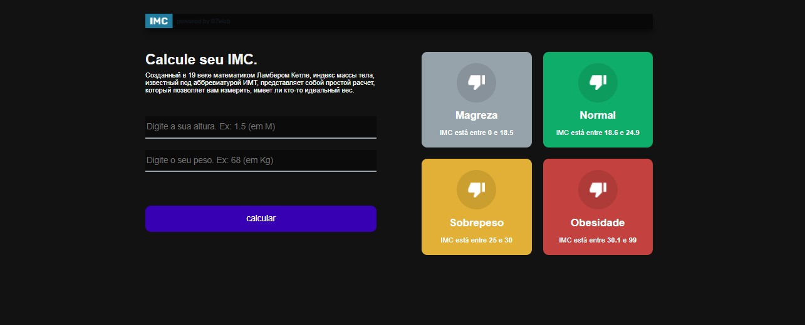

# Calculadora de IMC

Proejeto em React + Typescript. Fazendo uma calculadora de IMC

Projeto desenvolvido durante o curso B7web [B7web(https://b7web.com.br)]

### Instalação
    - `npm install`

### Para rodar

    - `npm start ou npm run start`

## Layout do Projeto

    